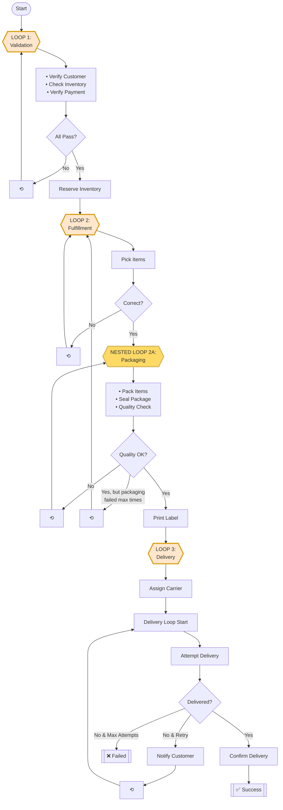

# Complex Multi-Loop Workflow Diagram

## Full Workflow Visualization

```mermaid
flowchart TD
    Start([Start Order Fulfillment]) --> Phase1{{"PHASE 1: VALIDATION LOOP"}}

    %% ========================================================================
    %% LOOP 1: ORDER VALIDATION
    %% ========================================================================

    Phase1 --> Loop1Start["Loop 1 Start<br/>(attempt counter)"]

    Loop1Start --> A1["Activity 1.1<br/>Verify Customer"]
    A1 --> A1Check{Customer<br/>Verified?}
    A1Check -->|No| Loop1Back1["⟲ Wait for<br/>Manual Verification"]
    Loop1Back1 --> Loop1Start

    A1Check -->|Yes| A2["Activity 1.2<br/>Check Inventory"]
    A2 --> A2Check{Inventory<br/>Available?}
    A2Check -->|No| Loop1Back2["⟲ Wait for<br/>Restock"]
    Loop1Back2 --> Loop1Start

    A2Check -->|Yes| A3["Activity 1.3<br/>Verify Payment"]
    A3 --> A3Check{Payment<br/>Verified?}
    A3Check -->|No| Loop1Back3["⟲ Wait for<br/>Payment Auth"]
    Loop1Back3 --> Loop1Start

    A3Check -->|Yes| A4["Activity 1.4<br/>Reserve Inventory"]
    A4 --> Loop1MaxCheck{Max Attempts<br/>Reached?}
    Loop1MaxCheck -->|Yes| FailValidation[["❌ Validation Failed"]]
    Loop1MaxCheck -->|No| Phase2{{"PHASE 2: FULFILLMENT LOOP<br/>(with nested packaging loop)"}}

    %% ========================================================================
    %% LOOP 2: FULFILLMENT (with nested LOOP 2A)
    %% ========================================================================

    Phase2 --> Loop2Start["Loop 2 Start<br/>(fulfillment attempt)"]

    Loop2Start --> B1["Activity 2.1<br/>Pick Items from Warehouse"]
    B1 --> B1Check{Items Picked<br/>Correctly?}
    B1Check -->|No| Loop2Back1["⟲ Re-pick Items"]
    Loop2Back1 --> Loop2Start

    B1Check -->|Yes| NestedLoop{{"NESTED LOOP 2A:<br/>PACKAGING QUALITY"}}

    %% Nested Loop 2A: Packaging
    NestedLoop --> Loop2AStart["Loop 2A Start<br/>(packaging attempt)"]

    Loop2AStart --> B2_1["Activity 2.2.1<br/>Pack Items in Box"]
    B2_1 --> B2_2["Activity 2.2.2<br/>Seal Package"]
    B2_2 --> B2_3["Activity 2.2.3<br/>Quality Check Package"]

    B2_3 --> B2_3Check{Quality<br/>Passed?}
    B2_3Check -->|No| Loop2ABack["⟲ Repackage"]
    Loop2ABack --> Loop2AStart

    B2_3Check -->|Yes| Loop2AMaxCheck{Max Packaging<br/>Attempts?}
    Loop2AMaxCheck -->|Yes| Loop2Back2["⟲ Restart Fulfillment"]
    Loop2Back2 --> Loop2Start

    Loop2AMaxCheck -->|No| B3["Activity 2.3<br/>Print Shipping Label"]

    B3 --> Loop2MaxCheck{Max Fulfillment<br/>Attempts?}
    Loop2MaxCheck -->|Yes| FailFulfillment[["❌ Fulfillment Failed"]]
    Loop2MaxCheck -->|No| Phase3{{"PHASE 3: DELIVERY LOOP"}}

    %% ========================================================================
    %% LOOP 3: DELIVERY
    %% ========================================================================

    Phase3 --> C1["Activity 3.1<br/>Assign Carrier"]
    C1 --> Loop3Start["Loop 3 Start<br/>(delivery attempt)"]

    Loop3Start --> C2["Activity 3.2<br/>Attempt Delivery"]
    C2 --> C2Check{Delivered<br/>Successfully?}

    C2Check -->|No| C3["Activity 3.3<br/>Notify Customer of Failed Attempt"]
    C3 --> Loop3Check{Retry<br/>Recommended?}
    Loop3Check -->|Yes| Loop3Back["⟲ Wait & Retry<br/>Delivery"]
    Loop3Back --> Loop3Start

    Loop3Check -->|No| C5["Activity 3.5<br/>Process Delivery Failure"]
    C5 --> FailDelivery[["❌ Delivery Failed<br/>Initiate Return"]]

    C2Check -->|Yes| C4["Activity 3.4<br/>Confirm Delivery"]
    C4 --> Success[["✅ Order Complete"]]

    %% ========================================================================
    %% Styling
    %% ========================================================================

    classDef loopStyle fill:#ffe6cc,stroke:#d79b00,stroke-width:3px
    classDef activityStyle fill:#dae8fc,stroke:#6c8ebf,stroke-width:2px
    classDef decisionStyle fill:#fff2cc,stroke:#d6b656,stroke-width:2px
    classDef failStyle fill:#f8cecc,stroke:#b85450,stroke-width:2px
    classDef successStyle fill:#d5e8d4,stroke:#82b366,stroke-width:2px
    classDef phaseStyle fill:#e1d5e7,stroke:#9673a6,stroke-width:3px
    classDef nestedStyle fill:#ffd966,stroke:#d6b656,stroke-width:3px

    class Loop1Start,Loop2Start,Loop2AStart,Loop3Start loopStyle
    class A1,A2,A3,A4,B1,B2_1,B2_2,B2_3,B3,C1,C2,C3,C4,C5 activityStyle
    class A1Check,A2Check,A3Check,B1Check,B2_3Check,C2Check,Loop1MaxCheck,Loop2MaxCheck,Loop2AMaxCheck,Loop3Check decisionStyle
    class FailValidation,FailFulfillment,FailDelivery failStyle
    class Success successStyle
    class Phase1,Phase2,Phase3 phaseStyle
    class NestedLoop nestedStyle
```



## Simplified Loop Structure



## Loop Summary Table

| Loop | Phase | Activities | Loop Condition | Max Attempts |
|------|-------|------------|----------------|--------------|
| **Loop 1** | Validation | 1.1 Verify Customer<br/>1.2 Check Inventory<br/>1.3 Verify Payment | Any validation fails → Loop back | 3 |
| **Loop 2** | Fulfillment | 2.1 Pick Items | Items picked incorrectly → Loop back | 3 |
| **Loop 2A** | Packaging (Nested) | 2.2.1 Pack Items<br/>2.2.2 Seal Package<br/>2.2.3 Quality Check | Quality check fails → Loop back to 2.2.1<br/>If max nested attempts → Loop back to Loop 2 | 3 |
| | | 2.3 Print Label | - | - |
| **Loop 3** | Delivery | 3.1 Assign Carrier<br/>3.2 Attempt Delivery<br/>3.3 Notify Customer (if failed) | Delivery fails & retry recommended → Loop back to 3.2 | 3 |
| | | 3.4 Confirm Delivery (success)<br/>3.5 Process Failure (max attempts) | - | - |

## Activity Flow Description

### LOOP 1: Order Validation Loop (Activities 1.1 - 1.4)
1. **Verify Customer** - Checks credit score, may need manual verification
2. **Check Inventory** - Ensures items in stock, may need restocking
3. **Verify Payment** - Authorizes payment, may need retry
4. **Reserve Inventory** - Final step before fulfillment

**Loop Condition**: If any validation fails, loop back to step 1

### LOOP 2: Fulfillment Loop (Activities 2.1 - 2.3)
1. **Pick Items** - Warehouse picking, may pick wrong items

**Loop Condition**: If picking fails, loop back to step 1

#### NESTED LOOP 2A: Packaging Quality Loop (Activities 2.2.1 - 2.2.3)
1. **Pack Items** - Pack in box
2. **Seal Package** - Seal the box
3. **Quality Check** - Verify packaging quality

**Nested Loop Condition**: If quality fails, loop back to 2.2.1 (pack items)
**Parent Loop Condition**: If nested loop fails max times, loop back to Loop 2 (pick items)

2. **Print Label** - Create shipping label (after packaging succeeds)

### LOOP 3: Delivery Loop (Activities 3.1 - 3.4)
1. **Assign Carrier** - Choose shipping carrier
2. **Attempt Delivery** - Try to deliver package
3. **Notify Customer** - If delivery failed
4. **Confirm Delivery** - Success path
5. **Process Failure** - Max attempts reached

**Loop Condition**: If delivery fails and retry recommended, loop back to step 2 (attempt delivery)

## Rendering the Diagram

To view the Mermaid diagrams:

1. **VS Code**: Install "Markdown Preview Mermaid Support" extension
2. **GitHub**: Diagrams render automatically in markdown files
3. **Online**: Copy diagram to https://mermaid.live
4. **CLI**: Use `mmdc` (mermaid-cli) to generate PNG/SVG

### Generate PNG from command line:
```bash
# Install mermaid-cli
npm install -g @mermaid-js/mermaid-cli

# Generate diagram
mmdc -i workflow_diagram.md -o workflow_diagram.png
```

## Notes

- **Orange boxes** = Loop start points
- **Yellow box** = Nested loop
- **Blue boxes** = Activities
- **Yellow diamonds** = Decision points
- **Red boxes** = Failure outcomes
- **Green box** = Success outcome
- **Purple boxes** = Phase markers
- **⟲ symbol** = Loop back indicator
